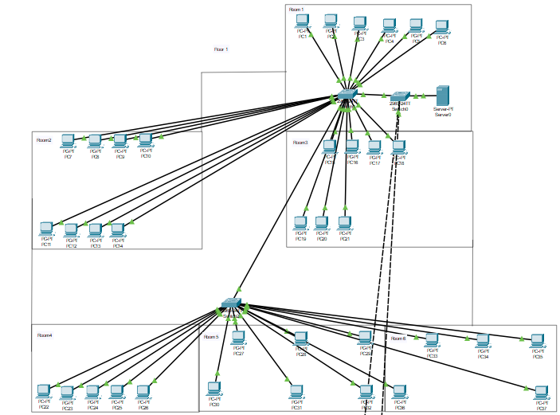

# 🌐 Enterprise Network Design

**A three-storey, 18-room enterprise network — technology survey, extended-star model, VLAN/subnet plan, Cisco IOS configs and a reproducible cost estimate.**

[-success?style=for-the-badge)](example-code/)

A coursework project ("курсовий проєкт") designing an information &
communication system for a typical three-storey, 18-room enterprise: a
technology survey (cloud storage, SD-WAN, network topologies, transport
protocols), an extended-star network model with a router/core-switch/
distribution-switch hierarchy, equipment selection, and a full cost
estimate -- 103 workstations across three floors for roughly 2.44M UAH of
hardware and cabling.

This repository is the English-language, GitHub-formatted version of a
Ukrainian-language coursework explanatory note completed at Y. O. Paton
Vocational College of Welding and Electronics, specialty 123 Computer
Engineering. The original is a design/procurement study with no VLAN plan,
IP addressing, or device configuration of any kind; this repo adds all
three as example code, clearly marked as written for the portfolio rather
than part of the graded submission.

  
   <b>Floor-1 topology</b> — extended-star: edge router → core switch → per-floor access switches → workstations.

## Why this exists

Most "design a network" coursework stops at picking hardware and totaling
a budget -- this one does too, in its original form. Working out the
example Cisco IOS configuration in this repo surfaced a real hardware
sizing gap in the original bill of materials (the chosen 8-port access
switches can't physically fit the rooms they're assigned to -- see
[`example-code/README.md`](example-code/README.md#findings-from-writing-these-configs)),
and writing the cost calculator in code surfaced two arithmetic mistakes
and a seat-count inconsistency in the original cost section (see
[`docs/report.md`](docs/report.md#editors-notes-on-this-translation)). Both
are now fixed and checkable by re-running the code, instead of just being
re-typed in English.

## Repository layout

| Path | Contents |
|---|---|
| [`docs/report.md`](docs/report.md) | Full English translation of the explanatory note: ICT/network technology survey, network model, equipment selection, cost estimate, conclusions. Includes an "Editor's notes" section listing every correction, redaction, and omission made for this repo. |
| [`docs/cost-estimate.md`](docs/cost-estimate.md) | The cost breakdown, generated by `example-code/cost_calculator.py` so the numbers are reproducible. |
| [`diagrams/`](diagrams/) | The original floor/room layout and the floor-1 network topology diagram, plus the two generic textbook illustrations (extended-star topology, SD-WAN architecture). Two screenshots from the original that exposed real names were left out -- see the editor's notes. |
| [`example-code/`](example-code/) | Not part of the original coursework. A VLAN/subnet planner and cost calculator (both unit-tested, stdlib-only), and example Cisco IOS configs for a core switch, three floor access switches, and an edge router implementing the addressing plan. |

## What's verified vs. what isn't

- `python3 -m unittest discover -s tests` in `example-code/` -- **14/14
  unit tests pass**, covering the VLAN/subnet plan (no overlapping subnets,
  every room's subnet fits its seat count, gateway addresses are correct)
  and the cost roll-up (per-floor and grand totals match a hand check).
- The `.cisco-configs/*.cfg` files are plain IOS-style configuration text.
  They have **not** been run through Packet Tracer, GNS3, or real hardware
  -- there's no lab or device behind this project, original or otherwise.
  Treat them as a worked example of how the addressing plan maps to IOS
  syntax, not as configs that have been booted and tested.

## License

Licensed under [PolyForm Noncommercial 1.0.0](LICENSE) — free for personal,
educational, and other noncommercial use. For a commercial license,
contact Damir.
