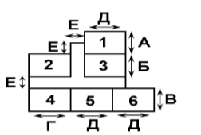
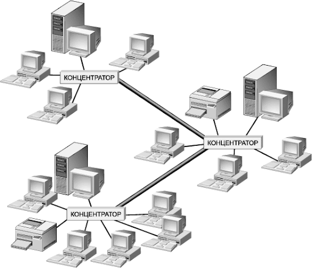
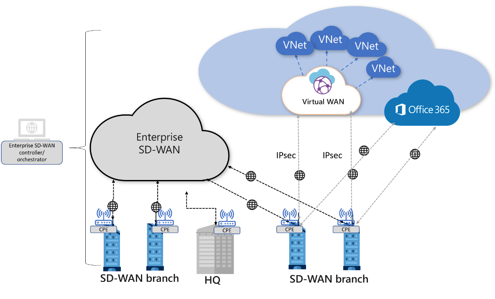

# Designing an Information & Communication System for a Typical Enterprise

Coursework project ("курсовий проєкт"), discipline "Computer Systems and
Networks," Y. O. Paton Vocational College of Welding and Electronics,
Cyclic Commission "Computer Systems and Networks."

- **Student:** Damir, 3rd-year, group [redacted], specialty 123 "Computer
  Engineering," educational program "Maintenance of Computer Systems and
  Networks"
- **Advisor:** [redacted]
- **Cyclic Commission Head:** [redacted]
- **City:** Dnipro
- **Assignment period:** issued 10 February, due 5 May
- **Variant:** No. 41

> This is the English, GitHub-formatted translation of a Ukrainian-language
> coursework explanatory note ("пояснювальна записка"). See
> [**Editor's notes**](#editors-notes-on-this-translation) at the end for
> what was corrected, redacted, or added relative to the original, and why.

## Assignment

Design an information & communication system for a typical enterprise
located in a three-storey building, per the assigned floor plan and variant.

The work covers: a review of information & communication technologies,
computer network technologies, network topologies, and data-transfer
protocols (per variant); construction of a network model; the active
equipment, user PCs, servers, and cabling required; a connection diagram
(topology); and a cost estimate for hardware, cabling, RAM, and storage.

**Variant 41 input data:**

| Parameter | Value |
|---|---|
| Cloud service | Google Drive |
| Network technology | Software-Defined WAN (SD-WAN) |
| WAN protocol | UUCP |
| Transport-layer protocol | SCTP |
| Ceiling height | 3.40 m |

## Introduction

The growth of digital technology and global communication networks has
substantially changed how information is processed, transmitted, and
stored, making effective information & communication systems (ICS) a core
part of how any enterprise operates. They let an organization unify all of
its structural units into a single information network, which improves
internal and external communication, streamlines business processes, and
raises productivity.

An information & communication system is a combination of hardware and
software components that handle the transmission, processing, storage, and
protection of information. Modern enterprises use a range of technologies
to organize this work, including computer networks, cloud services,
resource-management platforms, and information-security systems.

To improve efficiency and productivity, an enterprise needs to choose the
most cost-effective, modern solution for its network, while keeping the ICS
reliable, fast, and able to scale and integrate with other systems.

This project's task is to design an information & communication system for
a typical enterprise housed in a three-storey building, using Google Drive
as a cloud-based information environment, SD-WAN as the network technology,
UUCP as the WAN protocol, and SCTP as the transport-layer protocol.

## 1. Problem Statement

**Table 1.2 -- Room plan and dimensions (variant 41, "Plan 1"):**

| Ceiling height | A | B | C | D | E | F |
|---|---|---|---|---|---|---|
| 3.40 m | 6 | 5 | 6 | 5 | 7 | 2 |

**Table 1.3 -- Workstations per room:**

| Floor | Room 1 | Room 2 | Room 3 | Room 4 | Room 5 | Room 6 | Floor total |
|---|---|---|---|---|---|---|---|
| 1 | 6 | 8 | 7 | 5 | 6 | 5 | **37** |
| 2 | 4 | 5 | 4 | 6 | 7 | 5 | **31** |
| 3 | 6 | 8 | 4 | 7 | 3 | 7 | **35** |
| | | | | | | **Total** | **103** |

*Figure 1.1 -- Floor layout used to plan the computer network (room letters
A-F correspond to the dimension columns above).*

## 2. Main Part

### 2.1 Overview of information & communication technologies

This project uses the **Google Drive** cloud service as a centralized data
repository with shared access, version control, and automatic
synchronization. This lets employees work with files in real time whether
they're in the office or remote.

Google Drive also offers a high level of protection, including encryption
at rest and in transit, two-factor authentication, and user activity
logging, making it a convenient and secure place to store confidential or
business-critical information.

### 2.2 Overview of computer network technologies

**By scope, networks are classified as:**

- **PAN** (Personal Area Network) -- a network connecting personal devices
  within a few meters (e.g. Bluetooth).
- **LAN** (Local Area Network) -- a network within a single building or
  site.
- **MAN** (Metropolitan Area Network) -- spans a city.
- **WAN** (Wide Area Network) -- spans a country or continent.
- **GAN** (Global Area Network) -- an ultra-wide global network connecting
  devices worldwide.

**SD-WAN -- the key to a flexible, efficient corporate network**

SD-WAN (Software-Defined Wide Area Network) is a modern network technology
that centrally manages a distributed WAN infrastructure through software.
It fundamentally changes how corporate networks are built, letting an
organization combine different transport links (e.g. MPLS, LTE, xDSL,
fiber) into a single managed system.

Key benefits of SD-WAN:

- **Flexibility** -- the network adapts to current conditions and
  automatically switches traffic to the optimal link.
- **Cost savings** -- reduced reliance on expensive private lines (MPLS) by
  making more use of the public Internet.
- **Better performance** -- prioritization of business-critical traffic
  (VoIP, video, cloud services) and load balancing.
- **Security** -- end-to-end encryption, VPN connections, and built-in
  access-control tools.
- **Centralized management** -- administrators can manage every branch from
  a single interface, with policy-based routing, monitoring, and
  configuration.

One of SD-WAN's most important features is dynamic path selection based on
traffic type, available bandwidth, latency, and other parameters. For
example, a videoconference or cloud-service session can be steered onto the
least congested, fastest path in real time, keeping call quality acceptable
even under poor conditions.

SD-WAN also scales well: opening a new office only needs an Internet
connection and a pre-configured appliance -- there's no need to build out
complex infrastructure or lease private circuits.

**Network topology**

A network topology is how devices and links between them are physically or
logically arranged. The most common types:

- **Bus** -- every device shares one cable; simple and cheap, but
  unreliable.
- **Star** -- every device connects to a central node (a switch); easy to
  administer, but the central node is a single point of failure.
- **Ring** -- devices are connected in sequence, forming a loop; data
  travels around the ring.
- **Tree** -- a hierarchical combination of star or bus segments; suited to
  large-scale networks.

This project uses an **extended star** topology, which combines simple
administration with flexible expansion. A central node connects several
sub-networks, which allows the network to:

- scale quickly;
- support redundancy;
- improve reliability and continuity of service.

Combined with SD-WAN, this topology produces a dynamic, secure, centrally
managed network that's ready to integrate with cloud services and remote
offices.

*Figure 2.3 -- Extended star topology.*

**Network protocols**

Computer networks rely on protocols that define the rules for exchanging
data between devices. The most common:

- **TCP/IP** -- the basic data-transfer protocol of the Internet.
- **DNS** -- the domain name service.
- **HTTP/HTTPS** -- protocols for transferring web pages.
- **SSL/TLS** -- secure-connection protocols.

*Figure 2.4 -- SD-WAN architecture.*

### 2.3 Overview of data-transfer systems

A data-transfer system is the combination of hardware and software that
lets devices exchange information within local or wide-area networks. It's
the foundation of modern ICS, letting users, services, and devices interact
regardless of geographic location, over wired or wireless media, using
standard or specialized protocols.

This project uses a wired transfer medium, specifically **Cat5e UTP**
twisted-pair cable. This cable type provides high transfer speed,
reliability, resistance to electromagnetic interference, and is also
affordable -- which is why it's widely used in office, corporate, and
industrial networks where stable, predictable connectivity matters.

Beyond the physical medium, the protocols that govern how devices exchange
information matter just as much. Two protocols are considered here --
**UUCP** and **SCTP** -- which serve different roles but are equally
important for efficient, secure data transfer in different scenarios.

**UUCP (Unix-to-Unix Copy Protocol)** is one of the oldest data-exchange
protocols still in practical use in niche environments. It was designed for
copying files, sending email, and running remote commands between Unix
systems. Its main advantage is that it doesn't need a persistent network
connection -- data moves in batches during periodic sessions, which makes
it useful in environments with limited or intermittent network access. In
a modern setting, UUCP can serve as a backup data-exchange channel between
branch offices in rural or hard-to-reach areas, or in standalone industrial
sites where Internet access is unavailable but brief, periodic
synchronized access is possible.

**SCTP (Stream Control Transmission Protocol)** is a transport-layer
protocol that combines the advantages of TCP and UDP while adding features
critical for telecom and enterprise use. SCTP was originally designed to
carry signaling traffic in telephony networks (e.g. the SS7 standard), but
its properties make it effective for general data networks too. SCTP
supports **multistreaming** -- carrying several independent data streams
within one connection, so a stall on one stream (due to errors or delay)
doesn't affect the others -- and **multihoming** -- maintaining a
connection across several IP addresses simultaneously, so losing one path
doesn't break the connection. These properties make SCTP particularly
relevant for VoIP, videoconferencing, online gaming, banking transactions,
telemedicine, and other fields where delays or interrupted transfers are
unacceptable. Unlike TCP, SCTP supports frame-level message-integrity
checking and has built-in session separation, which simplifies application
development.

**Cloud integration in the data-transfer layer**

Beyond low-level protocols, modern ICT systems make heavy use of cloud
services that extend storage and data-exchange infrastructure. This project
uses Google Drive as a centralized data repository with shared access,
version control, and automatic synchronization, with built-in encryption,
two-factor authentication, and activity logging.

## 3. Investigative Part

### 3.1 Network model design

The enterprise occupies a three-storey building with a 3.4 m ceiling
height. Each floor has six separate rooms (18 rooms total) fitted with
computer equipment. Per the per-room table above, the distribution is 37
workstations on floor 1, 31 on floor 2, and 35 on floor 3 -- 103 devices in
total.

The physical infrastructure is built on a structured cabling system using
unshielded Cat5e (UTP) twisted pair, providing a stable transfer rate of up
to 1 Gbit/s within each network segment. The chosen topology -- extended
star -- combines simple management, reliability, and flexible scaling, and
allows traffic to be managed centrally while adapting quickly to internal
changes.

The network's core consists of a central router, a core switch, a server,
and six distribution switches (two per floor). The core equipment is housed
in the server cabinet in Room 3 on floor 1 -- a logistically convenient
spot for terminating the backbone cabling.

**Switch placement per floor:**

- Switch X.1 (in Room 1) serves Rooms 1, 2, 3.
- Switch X.2 (in Room 5) serves Rooms 4, 5, 6.

(Floors 2 and 3 follow the same pattern: switches 2.1/2.2 and 3.1/3.2
respectively.) All distribution switches connect to the core switch, which
considerably simplifies network management and maintenance.

SD-WAN lets the enterprise maintain a secure, flexible connection between
offices, data centers, or cloud services through software-centralized
traffic management, combining different link types (MPLS, LTE, fiber,
plain Internet) and automatically choosing the optimal path per traffic
type -- reducing infrastructure cost, improving performance, avoiding
downtime, and prioritizing critical services (VoIP, video conferencing,
cloud applications). SD-WAN also lets security policy be enforced at the
network edge, reducing the risk of connecting to open networks and
optimizing access to Google Drive and other services.

The model also includes an internal enterprise server for local needs
(databases, accounting, document workflow), reachable from both the
internal network and external cloud services through an SD-WAN-capable
gateway, balancing load and providing connection redundancy.

*Figure 3.1 -- Floor 1 network plan.*

### 3.2 Technical equipment for the computer network

This project (variant 41) implements a "smart," centrally managed,
automated network with cloud connectivity, accounting for the 3.40 m
ceiling height when planning equipment placement and cable runs.

**Cabling.** The physical layer uses structured cabling based on
unshielded Cat5e (UTP) twisted pair, supporting up to 1 Gbit/s and
Power-over-Ethernet (PoE) -- letting peripheral equipment be deployed
without extra power sources. The cable's flexibility and standard RJ-45
connectors give fast, reliable connections to switches, access points, and
other devices.

| Characteristic | Description |
|---|---|
| Cable type | U/UTP Cat 5e |
| Pairs | 4 pairs (8 conductors) |
| Conductor diameter | 0.49 mm |

*Table 3.1 -- Cat5e twisted-pair cable characteristics.*

**Router -- MikroTik hEX S.** The network's routing is built around the
MikroTik hEX S, chosen for configuration flexibility, stable operation, and
advanced network-administration features: traffic management, filtering,
monitoring, VPN, and integration with more complex infrastructure. It runs
**RouterOS**, which supports custom scripts (e.g. automatic failover
routing, time-based traffic limits). Its SFP slot supports fiber uplinks,
relevant for a high-speed provider or a fiber backbone connection. It has
hardware-accelerated IPsec encryption for building reliable VPN tunnels
between branches, and supports CLI/API automation for centralized
administration of larger infrastructure. Security-wise, it offers
packet-level filtering, anomaly detection, and DMZ zones, separating local
services from external traffic.

| Characteristic | Description |
|---|---|
| Ports | 5x Gigabit Ethernet (1-5), 1x SFP (fiber), 1x microUSB |
| Security | Firewall, packet filtering, NAT, DoS protection, access restriction, DMZ |
| Protocol support | IPv4, IPv6, VLAN, MPLS, OSPF, BGP, PPPoE, L2TP, SSTP, PPTP, IPsec, GRE, VRRP, SNMP, etc. |

*Table 3.2 -- MikroTik hEX S router characteristics.*

**Server -- HPE ProLiant DL380 Gen10.** The server handles user/database
management plus DNS, DHCP, and FTP server roles, interacting with the
router for reliable data access, storage, and security.

> **Editor's note:** the original document gives two different
> specifications for this server's CPU and RAM -- see
> [Editor's notes](#editors-notes-on-this-translation) item 3. Both are
> reproduced below, as given.

| Characteristic (Table 3.3) | Description |
|---|---|
| CPU | Intel Xeon E-2224G, 4 cores, up to 4.7 GHz |
| RAM | 16 GB DDR4, expandable to 64 GB |
| RAM slots | 4 DIMM slots |

*Table 3.3 -- HPE ProLiant DL380 Gen10 characteristics, as given in the
original spec table.*

The descriptive text elsewhere in the original report instead describes an
**Intel Xeon Gold 5218** (8 cores, up to 2.3 GHz) with **32 GB DDR4 RAM,
expandable to 3 TB**, storage of 2x1 TB SSD + 2x2 TB HDD, automatic
component health monitoring, and a 500 W 80+ Platinum PSU.

**Workstation -- HP ProDesk 400 G6.** A compact, capable office PC: Intel
Core i5-10500 (6 cores, 12 threads, up to 4.5 GHz), 8 GB DDR4 (2 slots, max
64 GB), 256 GB M.2 SSD -- enough for office software, databases, and web
applications without compromise.

| Characteristic | Description |
|---|---|
| CPU | Intel Core i5-10500 (6 cores, 12 threads, up to 4.5 GHz) |
| RAM | 8 GB DDR4, 2 slots (max 64 GB) |
| Storage | 256 GB M.2 SSD |

*Table 3.4 -- HP ProDesk 400 G6 characteristics.*

**Monitor -- Samsung LF24T350FHR.** A 24" IPS Full HD monitor with good
color reproduction and wide viewing angles. Flicker-Free and a low
blue-light mode reduce eye strain on long shifts.

| Characteristic | Description |
|---|---|
| Size | 24" |
| Resolution | 1920x1080 (Full HD) |
| Panel | IPS |

*Table 3.5 -- Samsung LF24T350FHR characteristics.*

**Keyboard -- Royal Kludge R75.** A reliable wireless mechanical keyboard
with a classic 75%-layout design, comfortable and quiet to type on -- a
good fit for office use.

> **Editor's note:** the original calls this keyboard "L75 75% Wireless
> Mechanical Keyboard" in its spec table/figure captions, but "Royal Kludge
> R75" in the cost section, conclusion, and bibliography link. Standardized
> here to "Royal Kludge R75" -- see
> [Editor's notes](#editors-notes-on-this-translation) item 4.

**Mouse -- Logitech G Pro X Superlight.** A simple, comfortable wireless
mouse with precise cursor positioning, suited to everyday office use.

**Core switch -- Ubiquiti UniFi Switch 24.** Every room's workstations
connect to a distribution switch; six are used in total, two per floor.
Since no floor exceeds 24 workstations connected to a single distribution
point, a 24-LAN-port switch was the target spec, with spare ports kept
free for future expansion (printers, Wi-Fi APs, CCTV).

The Ubiquiti UniFi Switch 24 fits this role: 24 ports at up to 1 Gbit/s
each, a non-blocking switching architecture with 48 Gbit/s of internal
switching capacity, PoE support (for APs/cameras without extra wiring), and
VLAN support for traffic isolation.

| Characteristic | Description |
|---|---|
| Ports | 24x Gigabit Ethernet (10/100/1000 Mbps) |
| Type | Managed |
| LAN port speed | 1 Gbit/s per port |

*Table 3.8 -- Ubiquiti UniFi Switch 24 characteristics.*

**Distribution switches -- Cisco CBS110-8T-D.** Six of these connect
groups of rooms on each floor (two per floor), each uplinking directly to
the core switch. The requirement was enough Gigabit ports for 4-8
computers across a few adjacent rooms, in an energy-efficient, compact,
easy-to-install package -- the CBS110-8T-D's 8 Gigabit Ethernet ports (up
to 16 Gbit/s aggregate) and IEEE 802.3az energy-saving support fit the
brief, and its small metal enclosure mounts on a desk, wall, or in a
service cabinet.

| Characteristic | Description |
|---|---|
| Ports | 8x 10/100/1000 Mbps RJ-45 |
| Type | Unmanaged |
| LAN port speed | 1 Gbit/s |

*Table 3.9 -- Cisco CBS110-8T-D characteristics.*

> **Editor's note:** the figure originally captioned "Figure 3.10 -- TP-LINK
> SG2008 switch" at this point in the document actually shows a Cisco
> CBS110-8T-D (matching this table and the cost section, which only ever
> prices CBS110-8T-D units). The caption text is corrected here; see
> [Editor's notes](#editors-notes-on-this-translation) item 2.

### 3.3 Network implementation cost estimate

Financial planning is a critical step in implementing any ICS: it
determines the investment required, optimizes resource allocation, checks
that equipment specs match real enterprise needs, and anticipates
maintenance and future scaling costs.

> **Editor's note:** the original cost calculation uses 37 seats for both
> floor 1 *and* floor 2 (the per-room table gives 31 for floor 2), and has
> a couple of arithmetic slips. The table below is recomputed from the
> per-room seat counts with corrected arithmetic --
> [`example-code/cost_calculator.py`](../example-code/cost_calculator.py)
> -- see [Editor's notes](#editors-notes-on-this-translation) item 1 for
> the full reconciliation against the original numbers.

**Per-seat cost** (PC + monitor + keyboard + mouse):

| Item | Cost (UAH) |
|---|---|
| HP ProDesk 400 G6 | 13,902 |
| Samsung LF24T350FHR monitor | 4,000 |
| Royal Kludge R75 keyboard | 1,289 |
| Logitech G Pro X Superlight mouse | 2,500 |
| **Total per seat** | **21,691** |

**Cost by floor** (recomputed; see
[`docs/cost-estimate.md`](cost-estimate.md) for the full breakdown and how
to regenerate it):

| Floor | Seats | Workstations (UAH) | Cabling (UAH) | Access switches (UAH) | Core equipment (UAH) | Floor total (UAH) |
|---|---|---|---|---|---|---|
| 1 | 37 | 802,567 | 7,310 | 7,600 | 163,300 | **980,777** |
| 2 | 31 | 672,421 | 7,650 | 7,600 | 0 | **687,671** |
| 3 | 35 | 759,185 | 7,480 | 7,600 | 0 | **774,265** |
| | | | | | **Grand total** | **2,442,713 UAH** |

Core equipment (floor 1 only): router (MikroTik hEX S) 3,300 UAH, core
switch (Ubiquiti UniFi Switch 24) 40,000 UAH, server (HPE ProLiant DL380
Gen10) 120,000 UAH = 163,300 UAH.

Cable run estimates (430 m / 450 m / 440 m for floors 1/2/3, at 17 UAH/m)
are kept as given in the original -- they're a physical-layout estimate
independent of the seat-count correction.

This level of financial detail confirms the technical approach is workable
and supports planning procurement and rollout. Using Google Drive as the
cloud environment, SD-WAN for adaptive traffic management, UUCP for
deferred data exchange, and SCTP for reliable transport gives the network
flexibility, scalability, and room to grow.

## Conclusions

This project implements a three-tier network infrastructure, split by
building floor and logically unified through the MikroTik hEX S router,
which acts as the main network-control node. This lets traffic be managed
through SD-WAN, with adaptive load distribution, redundancy, and simple
administration.

A structured Cat5e twisted-pair cabling system unifies all workstations
into a single network, providing enough bandwidth for current network
protocols at a reasonable cost for an office environment with a 3.4 m
ceiling height. Cable runs were planned with slack for maintenance and
routing distance to the central switches.

The switching layer consists of a main Ubiquiti UniFi Switch 24 on floor 1
and additional Cisco CBS110-8T-D distribution switches, two per floor.
This configuration gives stable data exchange between workstations and the
server, and centralizes how each floor connects to the backbone.

The HPE ProLiant DL380 Gen10 server provides compute: local data storage,
request processing, backups, and file exchange via UUCP, with a scalable
architecture that responds quickly to load changes.

The per-room table puts 103 workstations across the three floors (see
[Editor's notes](#editors-notes-on-this-translation) item 1 for why this
figure -- rather than the 105 or 111 mentioned elsewhere in the original --
is used). Each workstation pairs an HP ProDesk 400 G6 PC with a Samsung
LF24T350FHR monitor, a Royal Kludge R75 keyboard, and a Logitech G Pro X
Superlight mouse.

SCTP at the transport layer provides connection reliability, control over
critical data transfer, and resilience against an unstable link --
particularly relevant for inter-site messaging within the SD-WAN. Google
Drive is integrated as the base tool for collaboration, document archiving,
and rapid file exchange, extending the local infrastructure and keeping
information accessible regardless of where staff are physically located.

Overall, the resulting system meets modern requirements for stability,
security, speed, and scalability for a corporate network, built on proven
hardware and current protocols, and adaptable to future expansion.

## Sources used

1. Shevchuk, O. I. "Fundamentals of Computer Networks."
2. Buriachok, V. V. "Information and Cyberspace: Security Problems,
   Methods, and Countermeasures." National Aviation University, 2015.
3. Hrynevych, V. M. "Computer Networks."
4. Ramskyi, Yu. S. "Administration of Computer Networks and Systems."
   Magnoliia, 2023, 132 p.
5. Tkachenko, V. V. "Computer Network Technologies."
6. [MikroTik hEX S product page](https://rozetka.com.ua/ua/mikrotik-hex-s/p50878560/)
7. [Ubiquiti UniFi Switch 24 product page](https://rozetka.com.ua/ua/ubiquiti_unifi_switch_24/p11160030/)
8. [Cisco CBS110-8T-D product page](https://rozetka.com.ua/ua/cisco_cbs110_8t_d/p284304073/)
9. [HPE ProLiant DL380 Gen10 product page](https://rozetka.com.ua/ua/hpe_dl380_gen10/p173086503/)
10. [Cisco Networking Academy](https://legacy.netacad.com/portal/welcome-to-legacy-netacad/)
11. [HP ProDesk 400 G6 product page](https://rozetka.com.ua/ua/hp_prodesk_400_g6/p257907404/)
12. [Logitech G Pro X Superlight product page](https://hard.rozetka.com.ua/ua/logitech-g-pro-x-superlight/p376851243/)
13. [Royal Kludge R75 product page](https://rozetka.com.ua/ua/royal-kludge-rk-r75/p452928050/)
14. [Samsung LF24T350FHR product page](https://rozetka.com.ua/ua/samsung-lf24t350fhr/p233576831/)

## Editor's notes on this translation

This translation was produced for the GitHub portfolio version of the
project and makes the following changes relative to the original
Ukrainian-language document:

1. **Device-count reconciliation.** The original mentions four different
   totals for the number of workstations: 103 (sum of the per-room Table
   1.3), 105 (introduction: "35 on floor 1, 37 on floor 2, 33 on floor 3"),
   109 (cost section: 37 + 37 + 35, with floor 2 using 37 instead of the
   31 the room table gives it), and 111 (conclusion). This translation
   uses the per-room table (103 total: 37 / 31 / 35) as the source of
   truth, since it's the most granular, and recomputes the cost section
   from it in [`example-code/cost_calculator.py`](../example-code/cost_calculator.py)
   (output: [`docs/cost-estimate.md`](cost-estimate.md)). That recomputation
   also fixes two arithmetic slips found in the original: 21,691 x 37 is
   written as "801,567" (correct: 802,567), and floor 1's equipment
   subtotal already included its cabling cost, which then got added a
   second time in the floor's grand total, inflating it by 7,310 UAH. Net
   effect: the recomputed total (2,442,713 UAH) is lower than the
   original's stated total (2,578,169 UAH), mostly because of the floor-2
   seat-count correction (31 vs. 37).
2. **Figure/table caption fix.** "Figure 3.10" was captioned "TP-LINK
   SG2008 switch" in the original, but the embedded photo is a Cisco
   CBS110-8T-D -- matching Table 3.9's caption and the only switch model
   ever priced in the cost section. The image itself is unchanged; the
   caption is corrected.
3. **Server spec discrepancy, not resolved.** Table 3.3 and the
   surrounding descriptive paragraph give two different CPU/RAM specs for
   the same server (HPE ProLiant DL380 Gen10): the table says Intel Xeon
   E-2224G / 16 GB DDR4, the prose says Intel Xeon Gold 5218 / 32 GB DDR4.
   Both are reproduced as-is in section 3.2 rather than silently picking
   one, since there's no way to tell from the source material which one
   was intended.
4. **Keyboard naming standardized.** The original calls the same keyboard
   "L75 75% Wireless Mechanical Keyboard" in the spec table and figure
   captions, and "Royal Kludge R75" in the cost section, conclusion, and
   bibliography link. Standardized to "Royal Kludge R75" throughout this
   translation, since that's the name tied to the priced/sourced product.
5. **Two screenshots omitted.** The original includes two screenshots of
   the student's actual Google Drive account (illustrating "what is Google
   Drive" for section 2.1) that show real names of classmates/instructors
   and personal file listings. Both are omitted from this repository;
   section 2.1's text describes Google Drive's role without them.
6. **Personal/internal identifiers redacted:** student name -> "Damir,"
   advisor and committee-head surnames -> "[redacted]," group number ->
   "[redacted]." The college name and location are not redacted.
7. **Product-photo figures omitted.** The original includes a stock photo
   for most purchased components (router, server, PC, monitor, keyboard,
   mouse, both switch models) sourced from retail listings (see Sources).
   These are omitted here to keep the repository's image footprint small;
   full specs are in the tables above and the linked product pages.
8. **VLAN/IP addressing and Cisco IOS configuration are new.** The
   original report has no addressing scheme, VLAN plan, or device
   configuration of any kind -- see [`example-code/`](../example-code/)
   and its README for what was added for this repository and why.
